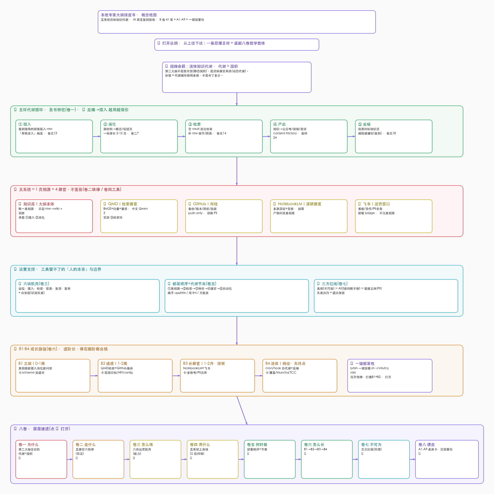

# second-brain-max-share

> 一套**从 0 复刻**「本地专家大脑 / 第二大脑」的完整方法论 + 一键部署包 + 概念地图。
> 让你的知识库**越用越懂你、越大越不卡**。
>
> A complete, copy-and-run playbook to build a **local expert second brain** that gets
> smarter as you use it and doesn't choke as it grows. Methodology + one-click deploy + concept map.

---

## 一图看懂



> 上图为概念地图（在 Obsidian 里打开 [`concept-map.canvas`](concept-map.canvas) 可交互编辑 / 点链接跳卷）。

---

## 📐 战略蓝图（McKinsey 式高密度版）

> 📄 **[strategy-hybrid-expert-brain.html](strategy-hybrid-expert-brain.html)** — 单页自包含 HTML，麦肯锡 Pyramid + SCQA + MECE + 因果级联 + 12 维信息密度 rubric。
> 给「一把手」5 分钟看懂全战略：Governing Thought · 5 互斥议题 · 6 节点因果链 · 4 模式检索决策 · 读者行动表 · 失真自报。
> *(Clone 到本地用浏览器打开看效果最好)*

---

## 🎴 十大实操锦囊（差异化价值，一眼看它能干嘛）

> 完整版见 [`guide/附录-十大实操锦囊.md`](guide/附录-十大实操锦囊.md)。每招 = 何时用 + 一句口令 + **只有本地大脑能做的那一刀**。

| # | 锦囊 | 一句口令 | 差异化（ChatGPT / 裸 Obsidian / 云 RAG 做不到） |
|---|---|---|---|
| ① | 找回记得说过但搜不到的原话 | `qmd query "那句话的大意"` | 向量召回"意思像字面不像"的 raw 原文 |
| ② | 决策前问"当年为什么这么定的" | 「我以前关于 X 怎么决策的、为什么」 | 决策的"为什么"是你的私有推理，外部 AI 没有 |
| ③ | 让 AI 用"你的味道"写东西 | 「按我库里的风格和观点写 X」 | 越用越懂你；ChatGPT 永远路人腔 |
| ④ | 别被纪要里放大的数字坑了 | 「这数字是 facts 还是 raw，核过吗」 | 你的大脑有可靠性分层，不自信复述错的 |
| ⑤ | 动手前先查"是不是已经有了" | `qmd query "这件事/这个能力"` | 复用收敛 vs 重写发散 |
| ⑥ | 一摞散材料一次深挖成报告/播客 | 「把 X 主题喂 NotebookLM 深研/播客」 | 长篇综合+音频只有 NotebookLM |
| ⑦ | 省 token：别让 AI 全文读爆账单 | 「用 qmd 检索后回答，别全文读」 | 只返相关片段，实测省 ~96% token |
| ⑧ | 在任何项目里调你的大脑 | 跨项目只读检索通道 | 知识不锁在一个 App 里 |
| ⑨ | AI 说"搞定了"先别信 | 「给我硬证据」+ 换工具复验 | "自报告失实是头号红线"刻进纪律 |
| ⑩ | PII 业务：本地可问答、对外脱敏 | 「本地问答敏感数据，不外传」 | 本地可问答 + git 不带走，云 RAG 得先上传 |

> **一句话记忆**：①②找回 · ③复利 · ④⑨验真 · ⑤⑥⑦提效 · ⑧跨项目 · ⑩守隐私。

---

## 这是什么

很多教你用 Obsidian 做第二大脑的教程，都没告诉你：**当知识库越来越大，基于 index 文件的搜索精度会逐渐下降，大脑会"宕机"。**

这套指南给出完整解法——一个**五系统活体知识代谢**架构：

```
        🧬 招牌命题：活体知识代谢（代谢 > 囤积）
                    │
   一个真相源（大脑本体）+ 四个器官，各司其职不重叠：
   🧠 OB 知识库   = 真相源（raw → 知识页 → 洞察）
   🔍 QMD        = 检索器官（BM25+向量+重排，中文 Qwen3，补全文细节）
   🦴 GitHub     = 脊柱（备份/版本/跨机）
   🔬 NotebookLM = 深研器官（多源综合+音频）
   🪟 飞书/Lark   = 运营窗口（看板/协作）
```

核心洞察（来自 Karpathy 的 LLM Wiki 模式 + Tobi Lütke 的 QMD）：
**wiki+index 管"已编译的骨架知识"，RAG/QMD 管"全 vault 的零散细节"——互补，不替代。**

## 快速开始（一键部署）

```bash
git clone <this-repo>
cd second-brain-max-share
bash deploy/一键部署.sh ~/你的vault brain
# step0自检 → step1装QMD → step2建脑(暂停粘提示词) → step3索引 → step4验真
```

完成后日常用：
```bash
qmd query "你的问题" -c brain     # 找细节/跨类语义
qmd update                        # 新笔记进检索（随手，秒级）
```

> 两件事无法纯脚本自动化（Obsidian 是 GUI、建知识库结构是 AI 干的活），所以这是
> **"脚本做确定性 + 提示词做 AI 部分 + 验真兜底"** 的最高自动化形态，不是骗人的全自动黑盒。

## 仓库结构

```
second-brain-max-share/
├── README.md              本文件
├── guide/                 绿皮书 8 卷（方法论全文）
│   ├── 00-总纲与八卷大纲.md
│   ├── 卷一-为什么…  卷二-是什么…  卷三-怎么练…  卷四-用什么…
│   └── 卷五-何时做…  卷六-怎么长…  卷七-不可为…  卷八-速查…
├── deploy/                一键部署包
│   ├── 一键部署.sh         真·一键编排器
│   ├── step0-环境自检.sh   step1-装QMD检索器官.sh
│   ├── step2-建脑主提示词.md（AI 建脑提示词）
│   ├── step3-接检索并索引.sh  step4-验真冒烟.sh
│   ├── CLAUDE.md.模板      大脑本体宪法模板
│   └── README-如何一键部署.md
└── concept-map.canvas     Obsidian Canvas 概念地图（在 Obsidian 里打开）
```

## 怎么读这本指南

- **想从 0 搭** → `guide/卷六`(B1-B4 路径) + `guide/卷四`(工具) + `deploy/`
- **已搭好想用好** → `guide/卷五`(节奏) + `guide/卷八`(A1-A9 速查卡)
- **想搞懂为什么** → `guide/卷一`(为什么) + `guide/卷二`(架构铁律)
- **怕踩坑** → `guide/卷八` A7 真实教训档案（QMD 装错目标 / HF 镜像 / config 优先级 / launchd TCC …全已预修进部署脚本）

## 成长路径（停在哪阶都合格）

| 阶段 | 做什么 | 周期 |
|---|---|---|
| **B1 立脑** | Obsidian + Claude.md + 三层结构 | 0-1 周 |
| **B2 通感** | QMD 检索（中文 Qwen3）+ GitHub 备份 | 1-2 周（个人到此够用） |
| **B3 长器官** | 按需接 NotebookLM / 飞书 | 1-2 月（可选） |
| **B4 活体** | cron/hook 自代谢 + 反哺循环 | 持续（可选） |

## 致谢 / Credits

- **LLM Wiki pattern** — Andrej Karpathy（[gist](https://gist.github.com/karpathy/442a6bf555914893e9891c11519de94f)）
- **QMD** — Tobias Lütke（[github.com/tobi/qmd](https://github.com/tobi/qmd)）
- **Qwen3-Embedding** — 阿里巴巴（让中文本地 RAG 达到商用质量）

## License

MIT — 见 [LICENSE](LICENSE)。自由使用、修改、分发；欢迎 issue / PR 共建。
